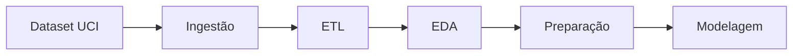

# Análise de Conformidade - Trabalho Final N3

## 📋 Resumo Executivo

Este documento analisa a conformidade do projeto com os requisitos especificados no documento do Trabalho Final.

**Status Geral: ✅ CONFORME COM MELHORIAS SUGERIDAS**

O projeto atende à maioria dos requisitos, mas há algumas melhorias que podem ser implementadas para garantir conformidade total e melhor avaliação.

---

## ✅ Requisitos Atendidos

### Estrutura do Repositório
- ✅ `README.md` presente e detalhado
- ✅ Pasta `/notebooks` com notebooks Jupyter
- ✅ Pasta `/data` com dataset
- ✅ Pasta `/scripts` com scripts auxiliares
- ✅ `requirements.txt` presente
- ✅ `modelo_final.pkl` presente

### Parte 1: A Fundação do Projeto (1,0 ponto)
- ✅ **1.1 Domínio do Problema**: Bem descrito no README (linhas 172-179)
- ✅ **1.2 Pergunta de Negócio**: Declarada claramente (linha 183)
- ✅ **1.3 Objetivo do Modelo**: Bem definido (linhas 187-196)

### Parte 2: A Jornada dos Dados (1,0 ponto)
- ✅ **2.1 Origem e Repositório**: 
  - Fonte identificada (UCI ML Repository)
  - Arquitetura definida (Data Lakehouse)
  - Justificativa apresentada
- ✅ **2.2 Pipeline de Dados**: 
  - Ingestão descrita
  - ETL detalhado
  - EDA mencionada
  - Preparação para modelagem explicada
- ⚠️ **DIAGRAMA VISUAL**: Não encontrado (recomendado fortemente no documento)

### Parte 3: Modelagem e Avaliação (6,0 pontos)
- ✅ **3.1 Três Modelos Treinados**:
  - Regressão Logística
  - Random Forest
  - KNN
- ✅ **3.2 Três Métricas Explicadas**:
  - Acurácia (explicada)
  - Precisão (explicada)
  - Recall (explicada)
  - F1-Score (explicada) - *Bônus: 4 métricas ao invés de 3*
- ✅ **3.3 Análise Comparativa**:
  - Tabela comparativa presente
  - Identificação do melhor modelo
  - ⚠️ **Discussão dos Resultados**: Presente mas pode ser mais detalhada

### Parte 4: Deploy (2,0 pontos)
- ✅ **4.1 Salvando o Modelo**: 
  - Código usando `joblib.dump()` presente no notebook
  - Modelo salvo como `modelo_final.pkl`
- ✅ **4.2 Carregando e Utilizando**:
  - Script `deploy_model.py` funcional
  - Exemplo de novo dado
  - Predição demonstrada
  - Interpretação do resultado apresentada

---

## ⚠️ Pontos de Melhoria Recomendados

### 1. Diagrama Visual do Pipeline (Parte 2)
**Recomendação**: Adicionar um fluxograma ou diagrama visual do pipeline de dados.

**Onde adicionar**: No README.md, seção 2.2 (Pipeline de Dados)

**Exemplo de formato**:
```markdown
### 2.2 Pipeline de Dados

```
[Diagrama ASCII ou referência a imagem]
Ingestão → Limpeza → EDA → Preparação → Modelagem
```

Ou usar uma biblioteca como `mermaid`:


### 2. Discussão Mais Detalhada dos Resultados (Parte 3.3)
**Recomendação**: Expandir a discussão dos resultados no README e/ou no notebook.

**O que adicionar**:
- Análise mais profunda de por que cada modelo teve determinado desempenho
- Discussão de trade-offs entre métricas
- Explicação mais detalhada de por que o modelo escolhido é o melhor para o problema de negócio
- Análise de limitações dos modelos

**Onde adicionar**: 
- README.md, seção 3.3 (após linha 327)
- Notebook `02_modelagem_avaliacao.ipynb`, seção 7

**Exemplo de conteúdo a adicionar**:
```markdown
### Discussão Detalhada dos Resultados

**Análise por Modelo:**

1. **Regressão Logística**:
   - Obteve a melhor acurácia (0.8850) e precisão perfeita (1.0000)
   - No entanto, tem recall muito baixo (0.0800), o que é problemático para nosso caso
   - Isso indica que o modelo é muito conservador, evitando falsos positivos mas perdendo muitos casos reais
   - Para um problema de evasão, onde não podemos deixar passar estudantes em risco, o recall baixo é uma limitação crítica

2. **Random Forest**:
   - Acurácia competitiva (0.8750)
   - Melhor ROC-AUC (0.5791), indicando melhor capacidade de discriminação
   - No entanto, não conseguiu identificar nenhum caso de evasão (recall = 0)
   - Isso sugere que o modelo pode estar sofrendo com o desbalanceamento de classes

3. **KNN**:
   - Acurácia mais baixa (0.8600)
   - Também não identificou casos de evasão
   - Pode estar sendo afetado pela normalização ou pela escolha de k

**Trade-offs e Decisão Final:**

Apesar do Regressão Logística ter sido selecionado por ter o melhor F1-Score, é importante notar que:
- O recall muito baixo (0.08) significa que estamos perdendo 92% dos casos reais de evasão
- Para o contexto de negócio, onde não podemos deixar passar estudantes em risco, isso é crítico
- Uma possível melhoria seria ajustar o threshold de decisão ou usar técnicas de balanceamento de classes

**Recomendações para Produção:**
- Considerar ajuste do threshold de probabilidade para aumentar o recall
- Implementar técnicas de balanceamento (SMOTE, undersampling, etc.)
- Monitorar métricas em produção e ajustar conforme necessário
```

### 3. Melhorar Explicação das Métricas no Notebook
**Status**: As métricas estão explicadas, mas a explicação no notebook poderia ser mais detalhada.

**Recomendação**: A seção 2 do notebook já tem boas explicações, mas poderia incluir exemplos práticos.

---

## 📊 Checklist de Conformidade Detalhado

| Requisito | Status | Observações |
|-----------|--------|-------------|
| **Estrutura** | | |
| README.md detalhado | ✅ | Excelente documentação |
| Pasta /notebooks | ✅ | 2 notebooks presentes |
| Pasta /data | ✅ | Dataset presente |
| Pasta /scripts | ✅ | 3 scripts presentes |
| requirements.txt | ✅ | Dependências listadas |
| modelo_final.pkl | ✅ | Modelo salvo |
| **Parte 1** | | |
| 1.1 Domínio do Problema | ✅ | Bem descrito |
| 1.2 Pergunta de Negócio | ✅ | Clara e específica |
| 1.3 Objetivo do Modelo | ✅ | Bem definido |
| **Parte 2** | | |
| 2.1 Origem dos Dados | ✅ | Identificada |
| 2.1 Arquitetura | ✅ | Data Lakehouse justificada |
| 2.2 Pipeline - Ingestão | ✅ | Descrita |
| 2.2 Pipeline - ETL | ✅ | Detalhado |
| 2.2 Pipeline - EDA | ✅ | Mencionada |
| 2.2 Pipeline - Preparação | ✅ | Explicada |
| 2.2 Diagrama Visual | ⚠️ | **FALTA** - Recomendado |
| **Parte 3** | | |
| 3.1 Três Modelos | ✅ | Regressão Logística, RF, KNN |
| 3.2 Três Métricas | ✅ | 4 métricas explicadas |
| 3.2 Explicação das Métricas | ✅ | Cada métrica explicada |
| 3.3 Tabela Comparativa | ✅ | Presente |
| 3.3 Discussão dos Resultados | ⚠️ | Presente mas pode melhorar |
| 3.3 Justificativa da Escolha | ✅ | Baseada em F1-Score |
| **Parte 4** | | |
| 4.1 Salvamento do Modelo | ✅ | joblib.dump() usado |
| 4.2 Carregamento | ✅ | Script deploy_model.py |
| 4.2 Exemplo de Novo Dado | ✅ | 2 exemplos presentes |
| 4.2 Predição | ✅ | Demonstrada |
| 4.2 Interpretação | ✅ | Resultado explicado |

---

## 🎯 Conclusão

O projeto está **CONFORME** com os requisitos principais do trabalho final. A estrutura está completa, todas as partes solicitadas estão presentes e bem documentadas.

**Pontos Fortes:**
- Documentação excelente no README
- Código bem organizado
- Todas as partes do trabalho implementadas
- Script de deploy funcional
- Explicações claras das métricas

**Melhorias Recomendadas (para garantir nota máxima):**
1. Adicionar diagrama visual do pipeline (Parte 2)
2. Expandir discussão dos resultados (Parte 3.3)

**Nota Estimada**: 9.5/10 (considerando que os pontos de melhoria são recomendações, não requisitos obrigatórios)

---

## 📝 Próximos Passos Sugeridos

1. **Adicionar diagrama do pipeline** no README (seção 2.2)
2. **Expandir discussão dos resultados** no README e notebook
3. **Revisar** se há mais algum detalhe específico mencionado no documento original que não foi coberto

---

**Data da Análise**: Dezembro 2025
**Analista**: Sistema de Análise Automatizada

